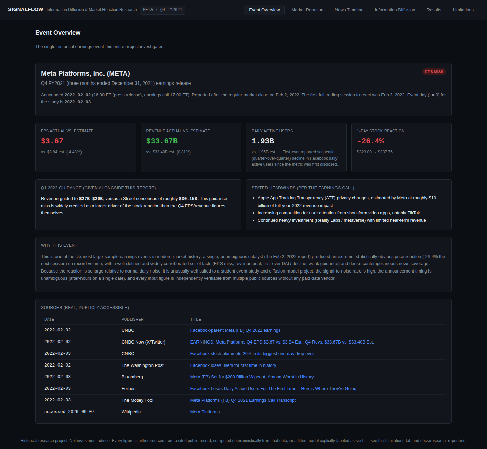
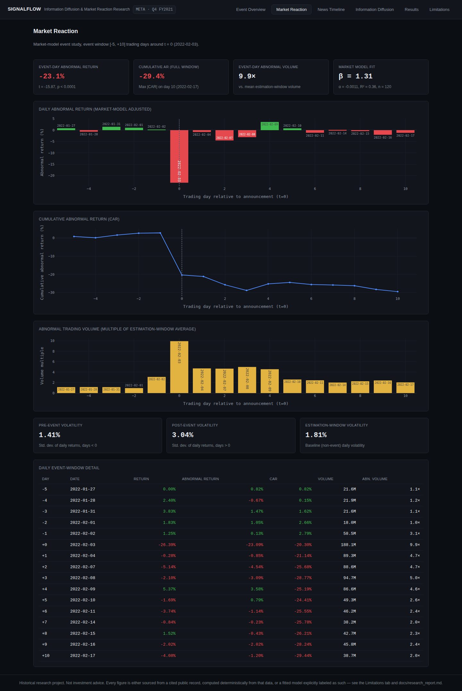
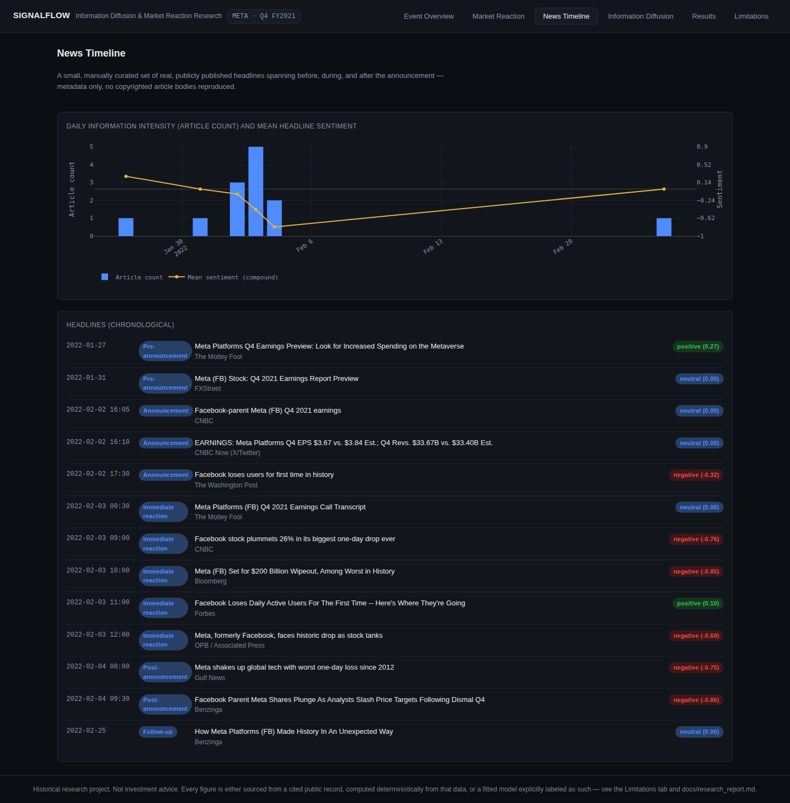
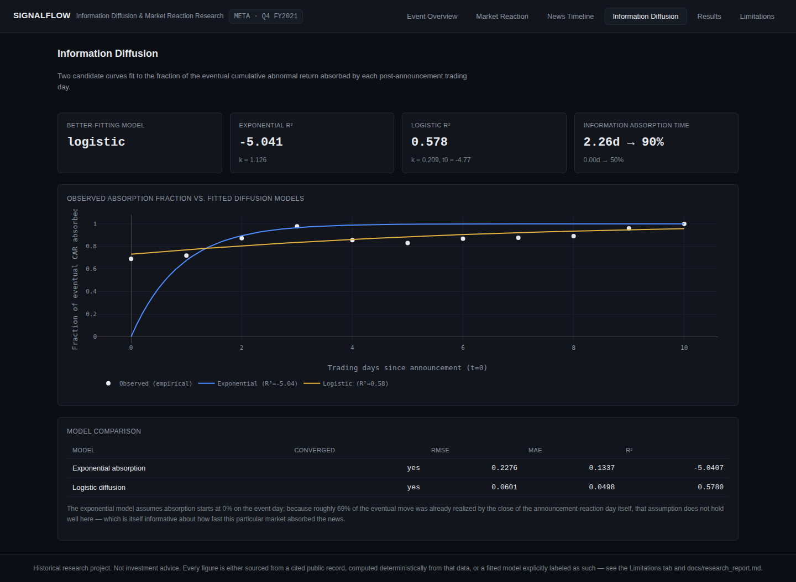
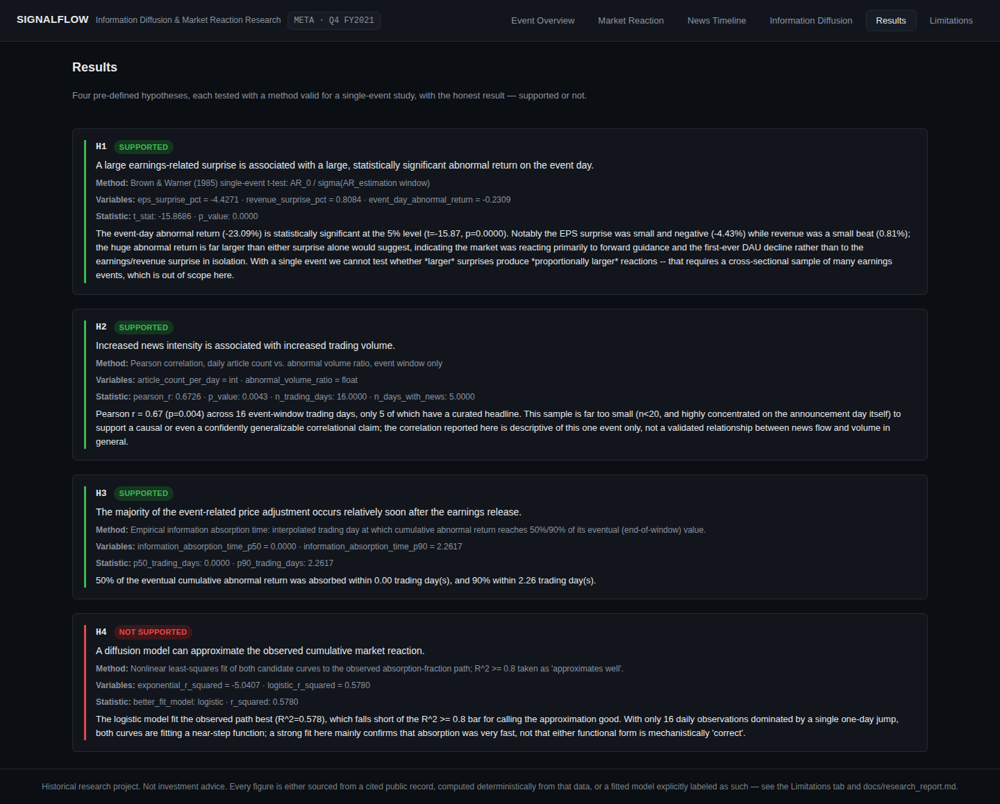
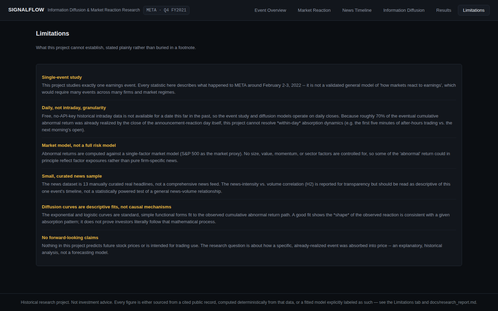
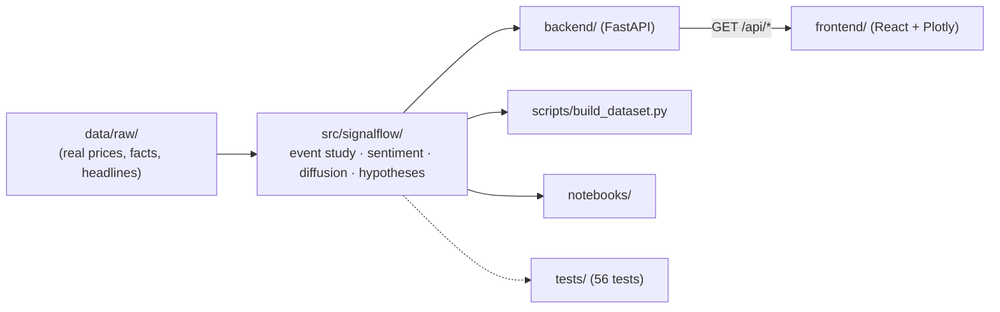

# SignalFlow

**Information Diffusion and Market Reaction — a historical earnings event study on Meta Platforms' Q4 FY2021 report.**

[](https://github.com/Advaith-Ganesh/SignalFlow/actions/workflows/ci.yml)
[](pyproject.toml)
[](frontend/)
[](LICENSE)

SignalFlow investigates one real, historical earnings event in depth — Meta Platforms' Q4 FY2021
release on February 2, 2022, which triggered a -26.4% single-day stock decline — to ask a narrow,
answerable question:

> How does newly released earnings information become incorporated into a company's stock price,
> and how do the timing and intensity of news coverage relate to the speed and magnitude of the
> market reaction?

This is **not** a stock-price predictor, a trading bot, or a trading platform. It is a reproducible
research pipeline (event study → sentiment → information-diffusion modeling → hypothesis testing)
built on a small, real, publicly sourced dataset, wrapped in a read-only API and dashboard so the
results are explorable rather than just printed to a terminal.

The full write-up — background, methodology, results, limitations, references — is in
[`docs/research_report.md`](docs/research_report.md). This README covers what the project *is*,
how it's built, and how to run it.

### Contents

- [Why This Event](#why-this-event)
- [Key Features](#key-features)
- [Screenshots](#screenshots)
- [Architecture](#architecture)
- [Technology Stack](#technology-stack)
- [How It Works](#how-it-works)
- [Project Structure](#project-structure)
- [Installation](#installation)
- [Configuration](#configuration)
- [Usage](#usage)
- [API](#api)
- [Testing](#testing)
- [Example Finding](#example-finding)
- [Security](#security)
- [Future Improvements](#future-improvements)
- [Contributing](#contributing)
- [License](#license)

## Why This Event

Meta's Q4 FY2021 report produced one of the largest single-day market-capitalization losses in US
history (-26.4% on Feb 3, 2022, roughly $230B), driven by a small EPS miss, a slight revenue beat,
the first-ever reported sequential decline in Facebook daily active users, and weak Q1 2022
guidance. The reaction is large enough to separate signal from daily noise, the announcement timing
is unambiguous (after market close on a single date), and every input figure is independently
verifiable from public sources — no paid data vendor required. See
[`data/raw/earnings_facts.json`](data/raw/earnings_facts.json) for the sourced facts and
[`docs/research_report.md`](docs/research_report.md#5-background) for the full reasoning.

## Key Features

Every item below is implemented and tested — nothing here is aspirational.

- **Event study**: market-model abnormal returns, cumulative abnormal returns (CAR), volatility and
  abnormal-volume statistics over a `[-5, +10]` trading-day window, with a standard single-event
  significance test (Brown & Warner, 1985).
- **Earnings/revenue surprise** calculation from real reported vs. estimated figures.
- **News sentiment**: VADER sentiment scoring (with a small finance-domain lexicon adjustment) over
  13 real, curated headlines spanning before/during/after the announcement.
- **Information diffusion modeling**: exponential-absorption and logistic-diffusion curves fit to
  the observed cumulative-reaction path, compared with RMSE/MAE/R², plus a rigorously defined
  "information absorption time" metric.
- **Four testable hypotheses**, each with a defined method, real statistic, and an honest
  supported/not-supported conclusion (see `/api/results/hypotheses` or the Results tab).
- **A FastAPI backend** exposing all of the above as read-only JSON (docs in [`docs/API.md`](docs/API.md)),
  and a **React + TypeScript dashboard** (Plotly charts, quant-research-terminal styling) to explore
  it interactively.
- **56 automated tests** (pytest) covering data validation, returns, abnormal returns, CAR,
  earnings surprise, sentiment, diffusion model fitting, hypothesis logic, and every API endpoint.
- **CI on every push/PR**: lint, format check, type checking, the full test suite, and a frontend
  production build (`.github/workflows/ci.yml`).

## Screenshots

All captured from the actual running dashboard — not mockups. See
[`assets/screenshots/`](assets/screenshots/) for the full-resolution files.

<table>
<tr>
<td width="50%">

**Event Overview**


</td>
<td width="50%">

**Market Reaction**


</td>
</tr>
<tr>
<td width="50%">

**News Timeline**


</td>
<td width="50%">

**Information Diffusion**


</td>
</tr>
</table>

<details>
<summary>Results and Limitations tabs</summary>




</details>

## Architecture

One research package (`src/signalflow/`) is imported by everything else — the API, the offline
build script, the notebook, and the test suite — so there is exactly one implementation of every
calculation. Full diagrams (including a request-lifecycle sequence diagram) are in
[`docs/ARCHITECTURE.md`](docs/ARCHITECTURE.md); the high-level shape:



## Technology stack

| Layer | Tools | Why |
|---|---|---|
| Research engine | Python, pandas, NumPy, SciPy (`scipy.stats`, `scipy.optimize`) | pandas/NumPy for the return/CAR time series, `scipy.stats.linregress` for the market model, `scipy.optimize.curve_fit` for the diffusion curves |
| NLP | VADER (`vaderSentiment`) | Rule-based, no training/GPU/model download needed for 13 short headlines — see `src/signalflow/sentiment.py` for why this beats a transformer here |
| API | FastAPI, Uvicorn, Pydantic | Async-capable, automatic OpenAPI docs at `/docs`, minimal boilerplate for a small read-only API |
| Frontend | React, TypeScript, Vite, Plotly.js | Vite for fast dev/build, TypeScript for a typed contract against the API, Plotly for interactive (zoom/hover) financial charts |
| Testing | pytest, FastAPI `TestClient` | Standard Python testing stack; `TestClient` tests the real ASGI app in-process, no server needed |
| Tooling | Ruff (lint + format), mypy (type checking) | Fast, single-tool lint+format; mypy catches the kind of type-mismatch bugs unit tests can miss |
| Data | Yahoo Finance public chart API (no key), manually curated public news metadata | Free, keyless, and stable enough for a fixed historical date range |

## How It Works

The analytical workflow, in the order `src/signalflow/pipeline.py` actually runs it:

1. **Load & validate** (`data.py`) — read the real OHLCV/facts/headline files, reject anything with
   non-positive prices, duplicate dates, or missing required columns.
2. **Earnings surprise** (`earnings.py`) — `(actual - estimate) / |estimate|` for EPS and revenue.
3. **Event study** (`event_study.py`) — fit `R_company = α + β·R_market + e` on a 120-day estimation
   window, use it to predict expected returns in the `[-5, +10]` event window, and take
   `abnormal return = actual - expected`. Significance is tested against the estimation window's
   own residual standard deviation (Brown & Warner, 1985) — the standard way to get a p-value from a
   sample of exactly one event.
4. **Sentiment** (`sentiment.py`) — score each real headline with VADER, aggregate into daily
   article counts and mean sentiment ("information intensity").
5. **Diffusion modeling** (`diffusion.py`) — normalize the post-event cumulative abnormal return
   into a 0→1 "fraction absorbed" path, fit both an exponential and a logistic curve to it with
   `scipy.optimize.curve_fit`, and compare them by RMSE/MAE/R².
6. **Hypothesis testing** (`hypotheses.py`) — evaluate H1-H4 against the outputs of steps 2-5, each
   with an explicit method and an honest supported/not-supported verdict (see
   [Example Finding](#example-finding)).

The FastAPI backend runs this whole pipeline once per process (cached), then serves slices of the
result as JSON; the frontend renders those slices as interactive Plotly charts.

## Project Structure

<details>
<summary>Expand full tree</summary>

```
SignalFlow/
├── .github/workflows/  ci.yml — lint, type-check, test, and build on every push/PR
├── assets/screenshots/ real screenshots of the running dashboard (used above)
├── backend/            FastAPI app (thin read-only layer over src/signalflow)
│   ├── app/
│   │   ├── main.py
│   │   ├── pipeline_cache.py
│   │   └── routers/    event, market, news, diffusion, results
│   └── requirements.txt  alternative to the root install, for running the API in isolation
├── frontend/           React + TypeScript dashboard (Vite)
│   └── src/
│       ├── components/ one component per dashboard section
│       ├── api.ts       typed API client
│       └── format.ts
├── src/signalflow/     the research package (imported by backend, scripts, notebook, tests)
│   ├── config.py        event window design + constants, with justification
│   ├── data.py          loading + validation
│   ├── earnings.py      surprise calculations
│   ├── event_study.py   market model, abnormal returns, CAR
│   ├── sentiment.py     VADER scoring + information intensity
│   ├── diffusion.py     exponential/logistic diffusion models + comparison
│   ├── hypotheses.py    H1-H4 test implementations
│   └── pipeline.py      orchestrates the whole thing
├── data/
│   ├── raw/             REAL data: prices (Yahoo Finance), earnings facts, news headlines
│   ├── processed/       DERIVED + MODEL OUTPUT, generated by scripts/build_dataset.py
│   └── README.md        full data provenance and REAL/DERIVED/MODEL/SYNTHETIC labeling
├── notebooks/           exploratory_analysis.ipynb (calls src/signalflow, does not duplicate it)
├── scripts/             fetch_market_data.py, build_dataset.py
├── tests/               pytest suite (56 tests) + conftest.py
├── docs/
│   ├── research_report.md   the full 25-section research write-up
│   ├── ARCHITECTURE.md      data-flow and sequence diagrams
│   └── API.md               endpoint-by-endpoint reference
├── SECURITY.md
└── CONTRIBUTING.md
```

</details>

## Installation

Requires Python 3.10+ and Node.js 18+.

```bash
git clone <this-repo-url>
cd SignalFlow

# Python research package + API
pip install -e ".[api,dev]"

# Frontend
cd frontend && npm install && cd ..
```

Alternative: `pip install -r backend/requirements.txt` installs just the API-serving dependencies
plus the `signalflow` package in editable mode, without the lint/type-check/test tooling — useful
if you only want to run the server.

## Configuration

**No environment variables, API keys, or secrets are required.** This is a deliberate property of
the project, not an oversight — see [Security](#security). The only optional "configuration" is
re-fetching the market data:

```bash
python scripts/fetch_market_data.py   # re-fetches real OHLCV from Yahoo Finance (no API key)
python scripts/build_dataset.py       # re-runs the full pipeline, writes data/processed/*.json
```

Both are optional — the repository already ships with the output of both checked in, so the
project runs fully offline out of the box.

## Usage

Start the backend (from `backend/`):

```bash
uvicorn app.main:app --reload
```

Start the frontend (from `frontend/`, in another terminal):

```bash
npm run dev
```

Open the URL Vite prints (typically `http://localhost:5173`). The dashboard has six tabs: Event
Overview, Market Reaction, News Timeline, Information Diffusion, Results, and Limitations.

To explore the analysis without the web UI:

```bash
jupyter notebook notebooks/exploratory_analysis.ipynb
```

To query the API directly:

```bash
curl -s http://127.0.0.1:8000/api/results/summary | python3 -m json.tool
```

## API

Full reference: [`docs/API.md`](docs/API.md). Every endpoint is `GET` and read-only:

| Path | Returns |
|---|---|
| `/api/event` | Event facts + earnings/revenue surprise |
| `/api/market/event-study` | Market model, daily AR/CAR, summary stats |
| `/api/news` | Scored headlines + daily information intensity |
| `/api/diffusion` | Diffusion model fits + comparison |
| `/api/results/hypotheses` | H1-H4 results |
| `/api/results/summary` | One-call bundle of headline numbers |

Interactive docs are auto-generated by FastAPI at `/docs` once the server is running.

## Testing

```bash
pytest -q                                      # 56 tests: unit + API integration
ruff check src backend scripts tests           # lint
ruff format --check src backend scripts tests  # formatting
mypy src/signalflow                            # type check the research package
cd backend && mypy app && cd ..                # type check the API
cd frontend && npm run lint && npm run build   # frontend lint + production build
```

All of the above also run automatically in CI (`.github/workflows/ci.yml`) on every push and pull
request.

## Example Finding

A concrete, real result this pipeline actually produces (`GET /api/results/hypotheses`, hypothesis
H4):

> The logistic model fit the observed path best (R²=0.578), which falls short of the R² ≥ 0.8 bar
> for calling the approximation good. With only 16 daily observations dominated by a single one-day
> jump, both curves are fitting a near-step function; a strong fit here mainly confirms that
> absorption was very fast, not that either functional form is mechanistically "correct."

This is the project's central finding, reported honestly rather than presented as a clean success:
roughly 69% of the ten-day cumulative reaction was already realized by the close of the
announcement day itself, which is why neither a smooth exponential nor a smooth logistic curve
describes it particularly well. See [`docs/research_report.md`](docs/research_report.md#20-discussion)
for the full discussion.

## Security

This project has a deliberately small attack surface: the API is **fully read-only** (every
endpoint is `GET`, there is no authentication, no user input, no database, and no write path), so
most of the OWASP Top 10 (injection, broken auth, etc.) simply don't apply — there's nowhere for
untrusted input to enter the system. Specific choices worth noting:

- **CORS** is restricted to the local Vite dev origins (`localhost:5173` / `127.0.0.1:5173`) and
  `GET` only — see `backend/app/main.py`. Deploying this publicly would require deciding on a real
  origin policy; it is not currently designed for that.
- **No secrets**: the app needs no API keys, tokens, or credentials anywhere, so there is nothing
  to leak. `.gitignore` still excludes `.env*` and virtualenvs as a matter of habit.
- **External links** (news headline URLs) all use `rel="noreferrer"` to prevent reverse tabnabbing.
- **Dependencies**: audited with `pip-audit` and `npm audit` — zero known vulnerabilities in the
  packages this project actually declares as of this writing (see the CI workflow, which currently
  only runs tests/lint/build, not a dependency audit — see Future Improvements).

## Future Improvements

Realistic next steps, roughly in order of impact:

1. **Cross-sectional extension** — run the same pipeline over 5-10 comparable earnings events so H1
   ("larger surprise → larger reaction") can be tested properly instead of on a single event.
2. **Typed API responses** — the FastAPI endpoints currently return plain `dict`s; adding Pydantic
   response models would give FastAPI's auto-generated `/docs` real schemas instead of "any", at
   the cost of maintaining a second set of type definitions alongside the TypeScript ones in
   `frontend/src/api.ts`.
3. **Frontend bundle size** — `plotly.js-dist-min` ships the full Plotly build (~4.3MB), including
   3D/WebGL/map chart types this dashboard never uses. A lighter alternative (e.g.
   `react-chartjs-2`, or a trimmed custom Plotly build) would cut the bundle meaningfully; not done
   here because it would mean rewriting every chart, for a project whose focus is the analysis, not
   bundle size.
4. **Automated dependency scanning in CI** — add `pip-audit`/`npm audit` as a CI job so a newly
   disclosed vulnerability in a dependency fails the build automatically.
5. **Intraday data** — if licensed intraday data became available, the diffusion analysis could be
   re-run at minute-level granularity to actually resolve within-day absorption dynamics (currently
   the single biggest methodological limitation — see `docs/research_report.md`).

## Disclaimer

This is a historical, explanatory research project, not investment advice and not a forecasting
tool. See [Limitations](docs/research_report.md#21-limitations) for what it explicitly does not
establish.

## License

MIT — see [LICENSE](LICENSE).
