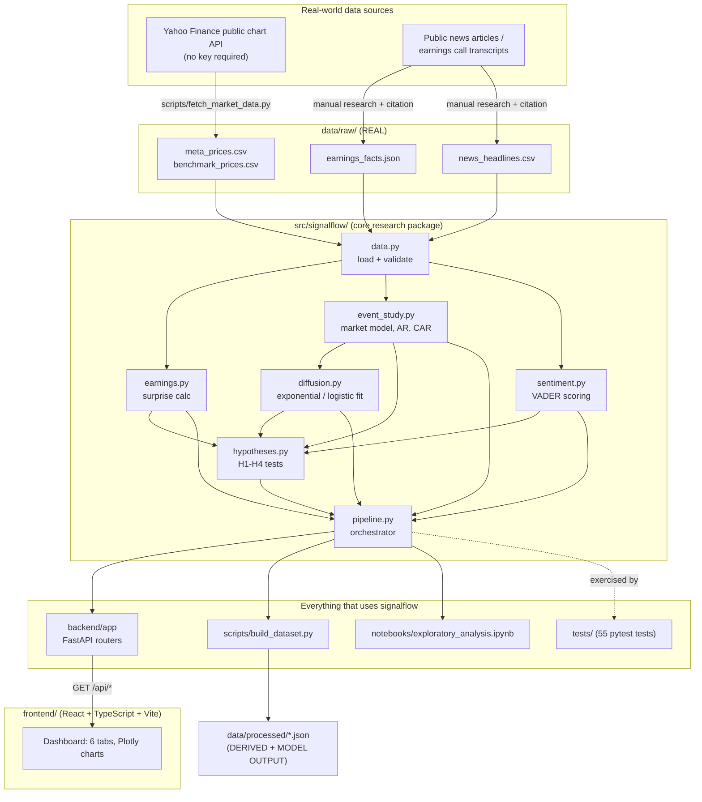
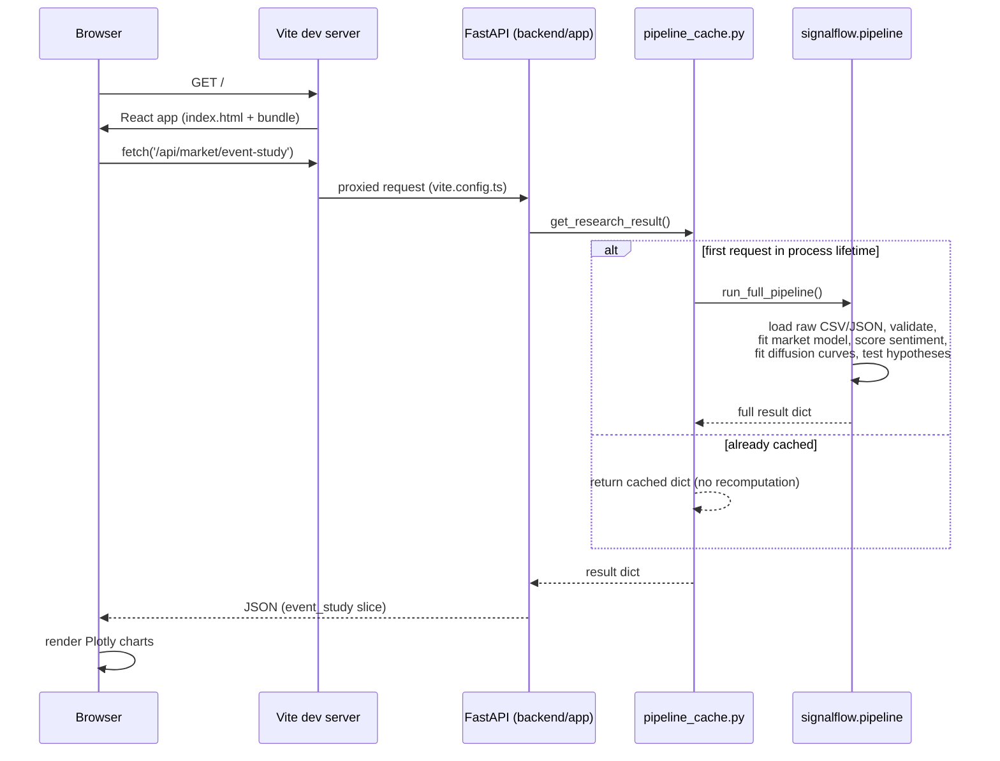

# Architecture

This document describes how SignalFlow is actually built, not an aspirational
design. Every component named here exists in the repository at the path
given.

## System overview

## Why the package sits in the middle

`src/signalflow/` is the single implementation of every calculation in this
project. Four different consumers call into it:

1. **`backend/app`** — a FastAPI app that calls `run_full_pipeline()` once
   (cached with `functools.lru_cache`) and serves slices of the result as
   read-only JSON.
2. **`scripts/build_dataset.py`** — runs the same pipeline offline and writes
   the result to `data/processed/*.json`, so the numbers are inspectable
   without starting a Python process.
3. **`notebooks/exploratory_analysis.ipynb`** — imports the same functions
   for exploratory plots. Nothing in the notebook re-implements logic that
   lives in the package.
4. **`tests/`** — 55 pytest tests, split between unit tests (synthetic data
   with a known, injected effect — e.g. a fabricated market beta or abnormal
   return shock — checked for exact recovery) and one integration test that
   runs the real pipeline against the real checked-in dataset.

This is a deliberate choice: if the market-model math changed, it changes in
exactly one place, and every consumer picks it up automatically.

## Request lifecycle (dashboard → data)

The pipeline is deterministic and takes well under a second on this dataset,
so caching it once per process is the simplest correct choice — there is no
database and no write path anywhere in this system.

## Data classification

Every artifact in this repository is one of four kinds, and the code and
directory structure keep them visibly separate (see `data/README.md` for the
full breakdown per file):

| Kind | Where | Example |
|---|---|---|
| **REAL** | `data/raw/` | Yahoo Finance OHLCV, hand-cited earnings facts, curated headlines |
| **DERIVED** | computed in `src/signalflow/{earnings,event_study}.py` | abnormal returns, earnings surprise % |
| **MODEL OUTPUT** | computed in `src/signalflow/diffusion.py` | fitted exponential/logistic curve parameters |
| **SYNTHETIC** | `tests/` only | fabricated data with a known injected effect, used to verify the math — never presented as real |

## Why not a database

The entire dataset (a handful of CSVs and JSON files covering one company,
one quarter) fits comfortably in memory and is static once fetched — there
is no user-generated data anywhere in the system. Adding a database would
introduce migration/connection-management complexity to solve a problem this
project doesn't have.

## Why not authentication

There is no user-specific data, no write endpoints, and nothing to protect —
every endpoint is a `GET` that returns the same read-only research result to
anyone who asks. Adding auth would protect nothing; see `README.md`'s
Security section and `docs/research_report.md` for the reasoning in full.
